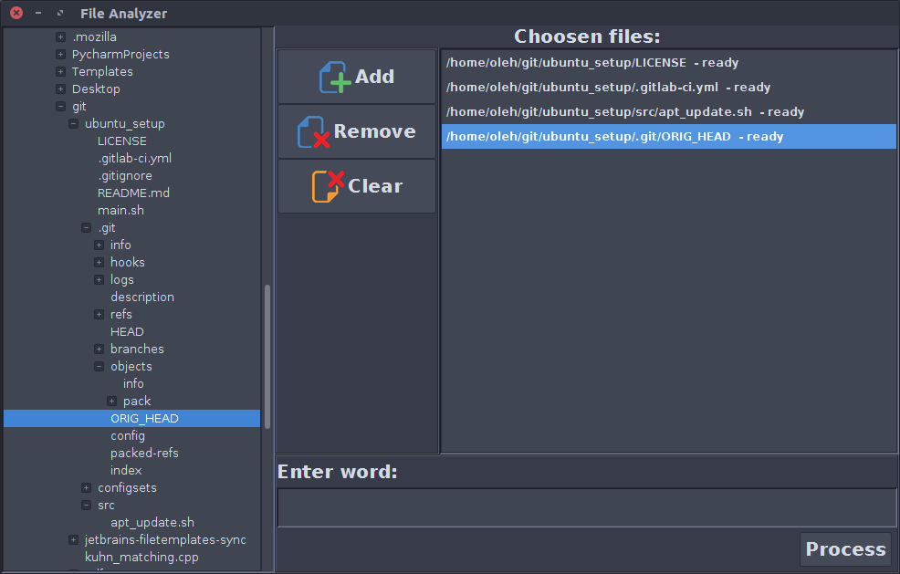
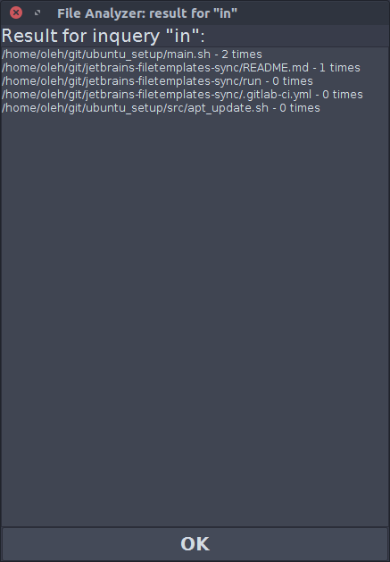

# NaUKMA Java Project 3 File Analyzer

Study project at NaUKMA (National University of Kyiv Mohyla Academy) Java course

## Project goal and requirements

The main goal of project is to create a primitive search system capable of
parsing the collection of files and processing requests over this collection.

This system had to have UI representing filesystem as tree for user to be
able to choose files to be preprocessed. The preprocessing should run in new
thread.

The search request is word to be found in preprocessed collection of files.

## Implementation

Window view at the start:

It is possible to choose and add files to the collection from the filesystem
tree at the left:

It is possible to choose a directory, in this case pop-up will appear to ensure
user choice:

You can type your request in the field at the bottom of window. The following
pop-up with results will appear. Files from collection are sorted in order or
frequency of requested word appearance in them. Note that tokenization and
search algorithms is very primitive:

While the big file is being loaded in the background, the pop-up telling to
wait appears:

In the main window, not yet loaded files are marked with proper note:

